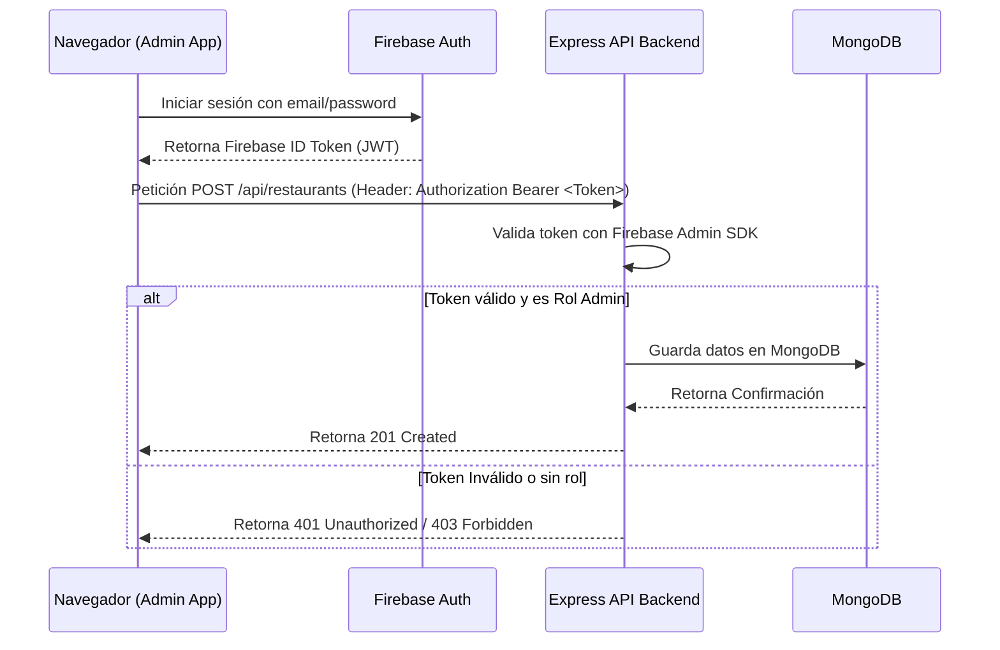

# Especificación de Arquitectura - Ginebra Latina

Esta especificación describe la arquitectura del sistema "Ginebra Latina" versión 1.0 y la preparación para la versión 2.0.

---

## 🛠️ Stack de Tecnologías

| Componente | Tecnología | Propósito |
| :--- | :--- | :--- |
| **Frontend Público** | Angular (TypeScript) | Aplicación web para el público en general |
| **Frontend Administrador** | Angular (TypeScript) | Panel de control privado del administrador |
| **Estilos** | Tailwind CSS v4 | Estilos visuales consistentes y rápidos |
| **Backend** | Node.js (Express + TypeScript) | API REST principal con patrón MVC |
| **Base de Datos** | MongoDB (Mongoose) | Base de datos NoSQL para almacenamiento flexible |
| **Autenticación** | Firebase Auth | Registro y validación de tokens JWT |
| **Almacenamiento** | Firebase Storage | Fotos de restaurantes, eventos y servicios |

---

## 📐 Estructura de Proyecto Limpia (Evitar Scrolling)

Para cumplir con la directiva de **código limpio** y **evitar el scrolling infinito**, se definen las siguientes reglas de diseño estructural:

### Reglas para el Backend (MVC)
1. **Rutas Independientes:** Cada recurso tiene su archivo de rutas (`/routes/restaurant.routes.ts`) que solo asocia URLs con métodos del controlador. No contiene lógica de negocio.
2. **Controladores Delgados:** Los controladores en `/controllers/` reciben la petición (req), validan entradas, delegan al modelo y retornan la respuesta (res). Cada método del controlador debe tener menos de 50 líneas.
3. **Modelos Aislados:** Los modelos de Mongoose se definen en `/models/` y solo configuran el esquema y tipos de datos.

### Reglas para Angular (Frontend)
1. **Componentes Atómicos:** Se crearán componentes independientes por cada elemento de la UI (ej. `restaurant-card.component`). Ningún archivo `.ts` de componente debe exceder las 150 líneas de código.
2. **Separación de Archivos:** Cada componente de Angular debe separar estrictamente:
   * `.html` (Estructura y HTML)
   * `.css` o `.scss` (Estilos propios si no usa Tailwind)
   * `.ts` (Lógica e interacción)
3. **Servicios de Red Aislados:** Los componentes no hacen peticiones HTTP directas. Consumen servicios (`/services/restaurant.service.ts`) que heredan `HttpClient` de Angular.

---

## 🔒 Control de Flujo de Autenticación

