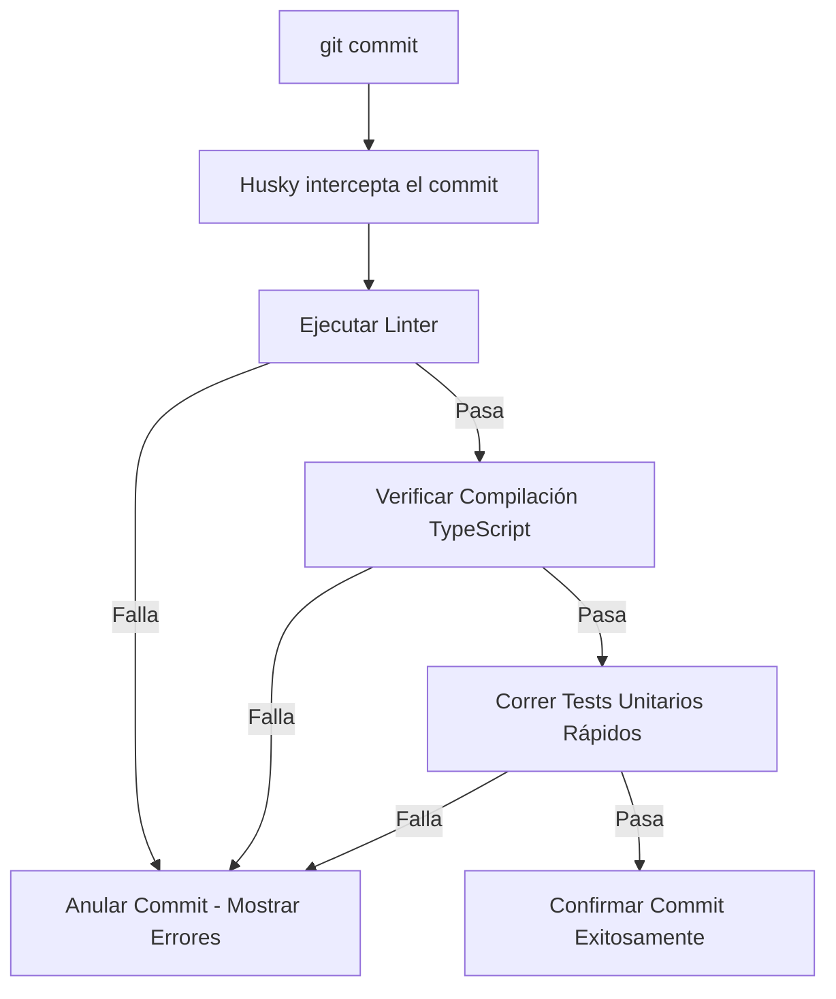

# Rol: Especialista en Calidad y Testing (`testing-skill.spec.md`)

Este documento define las reglas de juego y automatizaciones para el **VAR (Árbitro)** del equipo, encargado de validar el código mediante pruebas y compilación antes y después de cada commit.

---

## 🐕 El Árbitro: Git Hook con Husky

Para automatizar la verificación del código, configuramos un hook de Git del tipo `pre-commit` administrado por **Husky**:

---

## 🧪 Pruebas Unitarias (Unit Tests)

### En el Backend (Express)
*   **Herramienta:** Jest o Vitest.
*   **Regla:** Cada controlador debe tener un archivo de test unitario asociado (`*.controller.spec.ts` o `*.controller.test.ts`) que pruebe los métodos principales usando objetos Mock de request y response.

### En el Frontend (Angular)
*   **Herramienta:** Jasmine y Karma (por defecto de Angular) o Jest.
*   **Regla:** Cada componente de Angular creado con el CLI vendrá con su archivo `*.spec.ts`. Las pruebas básicas de renderizado y lógica del componente deben pasar sin fallas.

---

## 🛠️ Comprobación de Compilación (TS Build Check)

Antes de hacer un commit, el código de TypeScript debe compilar con éxito para evitar errores de tipo en producción.
*   En el backend ejecutamos: `tsc --noEmit` (verifica tipos sin generar archivos compilados).
*   En el frontend ejecutamos: `ng build` (o la validación de compilación de Angular).
