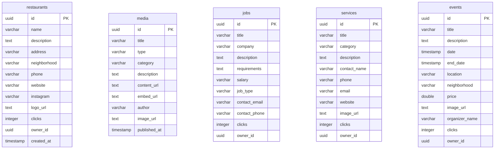

# Technical Specification and Project Manual: Arandu (MVP)

This document details the software architecture, database design, data flow, and development plan for the **Arandu** platform. Its goal is to serve as a clear and concise guide so that any programmer or AI agent can easily understand, maintain, and modify the system.

---

## 📐 1. General System Architecture

The platform is built using a decoupled modular approach. The frontends interact directly with **Supabase** for quick read and authentication tasks, while the **Backend (NestJS)** centralizes complex tasks like metrics tracking and write validations.

```mermaid
graph TD
    subgraph Frontend Applications
        FP[Public Frontend: Port 4200]
        FA[Admin Frontend: Port 4201]
    end

    subgraph Backend Services
        NE[NestJS API Server: Port 3000]
    end

    subgraph Cloud Infrastructure (Supabase)
        Auth[Supabase Auth: User Management]
        Storage[Supabase Storage: 'assets' Bucket]
        DB[(PostgreSQL Database)]
    end

    FP -->|Auth & Read| Auth
    FP -->|Query Content| DB
    FA -->|Auth, Storage & Write| Auth
    FA -->|Upload Photos| Storage
    FA -->|CRUD Tables| DB
    
    FP -->|Analytics Clicks| NE
    NE -->|Drizzle ORM| DB
```

---

## 🗄️ 2. Data Model (Postgres Database)

The database schema is managed using **Drizzle ORM**. The following entity-relationship diagram details the tables inside Arandu's database:



### Database Initialization:
To synchronize Drizzle schema definitions directly to your Supabase PostgreSQL instance:
```bash
cd backend
npx drizzle-kit push
```

---

## 🚀 3. Key MVP Features (Simple & Functional)

### A. Authentication
* Admin users log in securely using **Supabase Auth**.
* To streamline user onboarding during the MVP phase, email verification is disabled by default (configured by toggling off `Confirm email` inside the Supabase Console).

### B. Custom Tracking Metrics (Redirect Endpoint)
To measure ad and classified performance without invasive cookies:
1. External output links for restaurants/ads point to:
   `GET http://localhost:3000/api/redirect?id={ID}&type={restaurants|jobs|services|events}&url={URL_DESTINO}`
2. The **NestJS** backend intercepts the request, increments the corresponding row's `clicks` column, and redirects the user with `res.redirect(url)`.

### C. File Uploads
* Image assets (logos, banner ads, and news thumbnails) are uploaded directly to the public **`assets`** bucket inside **Supabase Storage**.

---

## 🧪 4. Unit Testing and Code Quality (Husky)

The project enforces an automated code quality pipeline using **Husky** to prevent broken code from being pushed to the repository.

### Git Hook Flow (Pre-commit)
Every time a developer attempts to run `git commit`, Husky automatically triggers:
1. **Linter**: Verifies code formatting and stylistic standards.
2. **TypeScript Compilation Check**: Ensures no compilation or type errors exist.
3. **Unit Tests**: Executes unit test suites using Vitest / Jest.

If any check fails, the commit is aborted automatically, keeping the repository's main branch stable.

---

## 🔒 5. Version V2 Roadmap (Security & Production Release)

To transition from this MVP to a secure production release (V2), the following enhancements will be implemented:

1. **Supabase Row Level Security (RLS)**:
   * Restrict anonymous user writes (`INSERT`/`UPDATE` operations).
   * Define granular database policies utilizing authorization tokens (`HTTP Authorization: Bearer <JWT>`).
2. **Mobile Identity Verification (SMS OTP)**:
   * Configure Supabase authentication providers to require SMS OTP (via Twilio or Vonage integration) for verifying users' phone numbers.
3. **Role-Based Access Control (RBAC)**:
   * Introduce user roles (`Admin`, `Editor`, `Publisher`, `Reader`) inside the database to restrict access levels across the admin dashboard modules.
